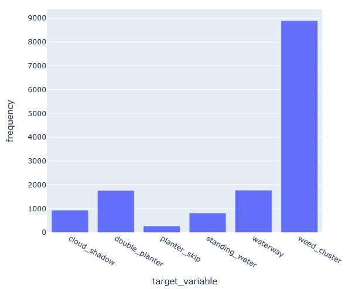

# agricultural_satellite_classifier
agricultural_satellite_classifier

This github repo has been created to store files related to the Agricultural Vision Segmentation Challenge. The dataset contains 21,061 aerial images of farmland in the United States. Each image contains 512x512 color channels which are RGB and Near Infra-Red. The images come with bounded copies indicated region of the farmland. The mask indicates valid pixels. 

There are 6 target variables: Cloud shadow, Double plant, Planter skip, Standing Water, Waterway and Weed cluster. These features are considered to have large impacts on the yield of farmland. Improving the ability to locate them is relevant to improving potential yields on farmland. There is a high level of difficulty in adressing potential overlaps between patterns and finding the best ways to process such a large amount of data in a memory efficent way.

The target variables are plotted below

